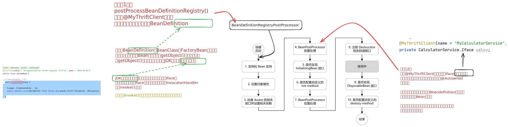

## 使用方法


### 1. 生成Thrift文件
* 根据thrift idl的相关规则编写对应的service
  * https://www.cnblogs.com/alianbog/p/9131231.html
* 使用`thrift -r --gen java xxxx.thrift`生成 `.class` 文件
* 将编译后的文件作为一个公共依赖/或者直接放到客户端(服务端)目录下

### 2. 编写Server端
* server端导入编译后的依赖以及thrift-server依赖。
```xml
<!-- 服务端依赖  -->
<dependency>
    <groupId>org.wjc</groupId>
    <artifactId>thrift-server</artifactId>
    <version>1.0-SNAPSHOT</version>
</dependency>
<!-- 接口依赖  -->
<dependency>
    <groupId>org.wjc</groupId>
    <artifactId>upload-iface</artifactId>
    <version>1.0-SNAPSHOT</version>
</dependency>
```
* 修改配置类
```yml
spring:
  thrift:
    server:
      server-id: thrift-upload-demo  # 服务名称
      service-model: hsHa  # thrift server模型
      port: 25004   # thrift server所在端口
      worker-queue-capacity: 10
      hs-ha:  # thrift server相关配置
        min-worker-threads: 5
        max-worker-threads: 20
        keep-alived-time: 5
      discovery:   # 注册中心地址
        enabled: true
        host: localhost
        port: 8500
        tags:
          - hsHa
          - demo-upload-25004
        health-check:
          enabled: true
          check-interval: 10
          check-timeout: 3
  cloud:  
    consul:  # consul 相关配置
      host: localhost
      port: 8500
      discovery:
        register: true
        register-health-check: true
        health-check-interval: 10s
        tags:
          - upload-8090
          - http
        health-check-path: /health
        service-name: thrift-upload-server
        instance-id: ${spring.cloud.consul.discovery.service-name}:${spring.cloud.client.ipAddress}:${server.port}
        prefer-ip-address: true 
```
* 实现service中的具体方法
* 加上`@ThriftService(name = "xxx",version = 2.0)` 
  * name  和 version 需要和客户端中的对应

样例：

```java
@ThriftService(name = "thrift-upload-demo",version = 2.0)  // 加上注解
public class UploadService implements uploadDemo.Iface{  // 实现Iface接口
    
    // 服务端实现具体的方法
    @Override
    public boolean upload(ByteBuffer file) throws TException, IOException {
        String filePath = "F:\\rpc_test\\getTest.txt";
        FileOutputStream fos = new FileOutputStream(filePath);
        BufferedOutputStream bos = new BufferedOutputStream(fos);
        bos.write(file.array());
        System.out.println(file.array());
        bos.flush();
        return true;
    }
}
```


### 3.编写Client端
* 引入依赖
```xml
<!-- 客户端依赖  -->
<dependency>
  <groupId>org.wjc</groupId>
  <artifactId>thrift-client</artifactId>
  <version>1.0-SNAPSHOT</version>
</dependency>
<!-- 接口依赖  -->
<dependency>
  <groupId>org.wjc</groupId>
  <artifactId>upload-iface</artifactId>
  <version>1.0-SNAPSHOT</version>
</dependency>
```
* 修改配置类
```yml
spring:
    application:
        name: thrift-calculator-client
    cloud:
      consul:  # consul 配置
        host: localhost
        port: 8500
        discovery:
          register: true
          register-health-check: false
          health-check-interval: 10s
          health-check-path: /health
          service-name: calculator-client-rest
          instance-id: ${spring.cloud.consul.discovery.service-name}:${spring.cloud.consul.host}:${server.port}
          prefer-ip-address: true
        retry:
          max-attempts: 3
          max-interval: 2000
    thrift:
      client:
        package-to-scan: com.wjc.thrift.client
        service-model: hsHa
        pool:  # 客户端连接池配置
          retry-times: 3
          pool-max-total-per-key: 200
          pool-min-idle-per-key: 10
          pool-max-idle-per-key: 40
          pool-max-wait: 1000
          connect-timeout: 2000

```
* 在需要用到的地方,将编译后`idl`中的`Iface`作为属性。加上`@MyThriftClient`注解,并写上和服务端一致的serviceId和version。然后在方法中直接调用即可。

样例：

```java
@RestController
@RequestMapping("")
public class TestController {

    @MyThriftClient(name = "UploadClient",serviceId = "thrift-upload-demo",version = 2.0)
    private uploadDemo.Iface up;  // 注意对应

    @PostMapping("/upload")
    public String uploadFile() throws IOException, TException {
        String filePath = "F:\\rpc_test\\test.txt";
        FileInputStream fis = new FileInputStream(filePath);
        BufferedInputStream bis = new BufferedInputStream(fis);
        int index = 0;
        byte[] buffer = new byte[1024];
        while((index = bis.read(buffer))!=-1){
            up.upload(ByteBuffer.wrap(buffer)); // 直接使用
        }
        return "finished";
    }
}

```


## 使用效果


## 项目用到了什么

整个项目的思想其实很简单。服务端采用Consul注册服务，客户端采用动态代理实现连接的过程。

### 服务端

1. 自定义了一个注解`@ThriftService`，并且给他加了`@Component`，那么在启动的时候加了这个注解的类就会作为一个Bean进行加载。

2. 在加载的过程中呢，从`ApplicationContext`中获得所有加了`@ThriftService`的Bean，根据注解的属性和yml中的属性，封装成一个对象。
3. 实现了`SmartLifecycle`接口，用于在`SpringBoot`启动的时候把所有的`ThriftServer`都启动起来。
4. 利用`@AutoConfigureAfter`控制自动配置类的执行顺序。
5. 将所有的`Server`注册到`Consul`上，并利用`tcp`进行服务健康检查。
6. 利用`Springboot`的类加载机制，定义`spring.factories`文件。

### 客户端

1. 自定义了一个注解`@MyThriftClient`，用于标记`idl`中的`Iface`类。使其能够直接在客户端远程调用服务端的逻辑。



> Bean的生命周期示意图，图源：https://chaycao.github.io/2020/02/15/%E5%A6%82%E4%BD%95%E8%AE%B0%E5%BF%86Spring-Bean%E7%9A%84%E7%94%9F%E5%91%BD%E5%91%A8%E6%9C%9F.html

2. 利用`模板方法模式`定义负载均衡算法接口，并实现`RoundRobin`轮询Consul上所有的服务，达到负载均衡的效果。
3. 使用`GenericKeyedObjectPool`创建`TTransport`连接，缓存客户端和服务端之间的连接，避免重复创建连接带来的开销。
4. 利用了Spring中Bean的生命周期的各种后置处理器，根据注解动态创建`BeanDefinition`。
5. 利用JDK动态代理代理IDL生成的`Iface`类，并用`FactoryBean`生成代理对象。
6. 在`InvocationHandler`中的`invoke()`方法内实现了客户端服务端建立连接的部分。
7. 结合4&5&6实现了仅使用注解就能进行RPC访问的功能。
8. 利用`ScheduledThreadPoolExecutor`实现定时任务，定期扫描Consul上健康的服务。

## 最后

思路来源：https://github.com/ostenant/spring-cloud-starter-thrift

在源代码基础上进行了优化，把两次动态代理优化到一次，减少动态代理的开销，提升了性能。

同时精简了注释的个数(客户端现仅需使用1个注解)，使得用户使用更加方便。
